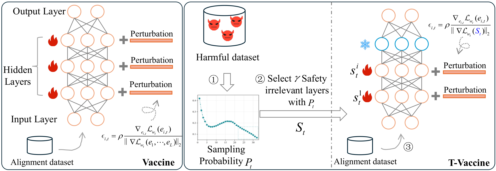

<!-- markdownlint-disable first-line-h1 -->
<!-- markdownlint-disable html -->


<h1 align="center">Targeted Vaccine: Safety Alignment for Large Language Models against Harmful Fine-Tuning via Layer-wise Perturbation</h1>


Harmful fine-tuning attack poses a serious threat to the online fine-tuning service. Vaccine, a recent alignment-stage defense, applies uniform perturbation to all layers of embedding to make the model robust to the simulated embedding drift. However, applying layer-wise uniform perturbation may lead to excess perturbations for some particular safety-irrelevant layers, resulting in defense performance degradation and unnecessary memory consumption.  To address this limitation, we propose a Targeted Vaccine (T-Vaccine), a memory-efficient safety alignment method that applies perturbation to only selected layers of the model. T-Vaccine follows two core steps: First, it uses gradient norm as a statistical metric to identify the safety-critical layers. Second, instead of applying uniform perturbation across all layers, T-Vaccine only applies perturbation to the safety-critical layers while keeping other layers frozen during training.   Results show that T-Vaccine outperforms Vaccine in terms of both defense effectiveness and resource efficiency. Comparison with other defense baselines, e.g., RepNoise and TAR also demonstrate the superiority of T-Vaccine. Notably, T-Vaccine is the first defense that enables a fine-tuning-based alignment method for 7B pre-trained models trained on consumer GPUs with limited memory (e.g., RTX 4090). 
 
 <div align="center">
  
</div>

## Attention
T-Vaccine is the first defense that can address harmful fine-tuning issues for **7B pre-trained models** trained on consumer GPUs with limited memory (**e.g., RTX 4090, RTX 3090**). However, existing methods such as Vaccine, RepNoise, TAR, etc. require high-performance GPUs such as **A100**, **A6000**, etc. to run.

## Package requirement
The package requirement is listed in `environment.yml`. Run the following code to install the packages with anaconda.  
```
conda env create -f environment.yml
```

## Data  preparation
For finetuning task, we first need to run the following scripts to prepare the sueprvised finetuning data.
```
cd sst2
python build_dataset.py
cd ../gsm8k
python build_dataset.py
cd ../ag_news
python build_dataset.py
cd ..
```

## Huggingface Llama2 access
Llama2-7B is a gated repo, which need a formal request to get access to the model. Check out https://huggingface.co/meta-llama/Llama-2-7b-hf.
After applying permission from meta, you should be able to access the model, but you first need to enter your token in the file `huggingface_token.txt`.


## Example command to run

We prepare scripts for re-producing all the experiments in the paper.

We first run TVaccine (with perturbation intensity=3) to produce the aligned model. 
```
cd script/alignment
bash  T-Vaccine.sh 3
```
Then we finetune the model using 10% of harmful data with a total number of 1000 samples from SST2 dataset. 
```
cd ../tvaccine_finetune
bash sst2.sh 0.1 1000
cd ../..
```

For comparison, the baseline SFT alignment can be run with the following code.
```
cd script/alignment
bash  SFT.sh 
```

Then we finetune the model with the same data setting.

```
cd ../sft_finetune
bash  sst2.sh 2 0.1 1000
```

